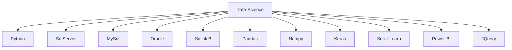

#  Hola, mi nombre es Liner Lander 👋
- 🌱 I'm data science junior
- 🔭 Exploring Machine Learning 

<!--------------------------------------------------------------------------------------------------------------------------------------->

<!--------------------------------------------------------------------------------------------------------------------------------------->

  
   
  
  

 

<!--------------------------------------------------------------------------------------------------------------------------------------->

 

<!--------------------------------------------------------------------------------------------------------------------------------------->

      
    

 
<a href="https://www.instagram.com/👽/" target="_blank"> 
  
<!--------------------------------------------------------------------------------------------------------------------------------------->

<!--------------------------------------------------------------------------------------------------------------------------------------->

 
   
      
     
   
   
    
    

<!--------------------------------------------------------------------------------------------------------------------------------------->

 
<b>Visitors Count 👽 </b>
  

 
 

<!--------------------------------------------------------------------------------------------------------------------------------------->

<!--------------------------------------------------------------------------------------------------------------------------------------->

<table style="width:100%">
<tr>
<td>

</td>
<td>

</a>
</td>
<td>

</td>
</tr>
<tr>
</table>
<!--------------------------------------------------------------------------------------------------------------------------------------->

