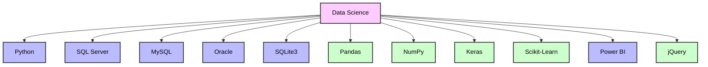

#  Hi, mi name is Liner Lander 👋

<!--------------------------------------------------------------------------------------------------------------------------------------->

## 📊 About Me

🎓¡Hola! Soy Liner Lander, un apasionado del análisis de datos con un toque de magia. 💫 Me muevo entre los mundos del **Data Science**, **Data Engineering** y **Data Analysis**, donde convierto datos complejos en soluciones sorprendentes. 🚀 Mi objetivo es optimizar procesos y llevar a las empresas a un nuevo nivel de eficiencia a través de la tecnología. ¿Listo para explorar el emocionante universo de los datos juntos? ⚙️💻

---

## 🧠 Skills

**Languages & Tools:**

**Specialties:**

- 📊 Data Analysis and Visualization
- 🤖 Machine Learning and Predictive Models
- 🛠 Data Engineering and ETL
- 📈 Business Intelligence (Power BI, DAX, Power Query)
- 🌐 Cloud-based Data Solutions
- 🔍 Statistical Analysis and Hypothesis Testing

---

## 📈 Featured Projects

### 💎 [Diamond Prediction - Mina](https://github.com/linerlander/Proyecto-Prediccion-Diamante.git)

- **Descripción**: Análisis de datos de casi 54,000 diamantes para predecir su valor mediante un modelo de regresión lineal, optimizando la toma de decisiones en el mercado de joyas.
- **Herramientas**: Python, Pandas, NumPy, Matplotlib, Scikit Learn, Figma, Excel
- **Logros**:
  - Exploración exhaustiva de un conjunto de datos de casi 54,000 diamantes para descubrir patrones clave.
  - Selección de muestras representativas para garantizar la calidad del análisis.
  - Pre-selección de variables relevantes que impactan el valor de los diamantes.
  - Preparación de datos para un análisis efectivo, asegurando precisión y consistencia.
  - Desarrollo de un modelo de regresión lineal para predecir el valor de cada diamante, respaldado por métricas de desempeño precisas.

### 🚌 [WayBus Database Project - WayBus](https://github.com/linerlander/Proyecto-WayBus-Base-de-Datos.git)

- **Descripción**: Creación una base de datos para gestión en WayBus, optimizando la información sobre clientes, vendedores y rutas. 📊
- **Herramientas**: SQL, Power BI, Figma
- **Logros**:
  - Creación de una base de datos que integra datos de clientes, vendedores y ventas.
  - Implementación de un sistema para el seguimiento de rutas y autobuses.
  - Desarrollo de informes interactivos para el análisis de ventas.
  - Optimización del manejo de datos para reducir errores.
  - Mejora en la satisfacción del cliente a través de un control más efectivo.
---

## 📫 Contact Me

<!--------------------------------------------------------------------------------------------------------------------------------------->

  
   
  
  

 

<!--------------------------------------------------------------------------------------------------------------------------------------->

 

<!--------------------------------------------------------------------------------------------------------------------------------------->

<!--------------------------------------------------------------------------------------------------------------------------------------->

<!--------------------------------------------------------------------------------------------------------------------------------------->

 
<b>Visitors Count 👽 </b>
  

 
 

<!--------------------------------------------------------------------------------------------------------------------------------------->

<!--------------------------------------------------------------------------------------------------------------------------------------->

<table style="width:100%">
<tr>
<td>

</td>
<td>

</a>
</td>
<td>

</td>
</tr>
<tr>
</table>
<!--------------------------------------------------------------------------------------------------------------------------------------->

